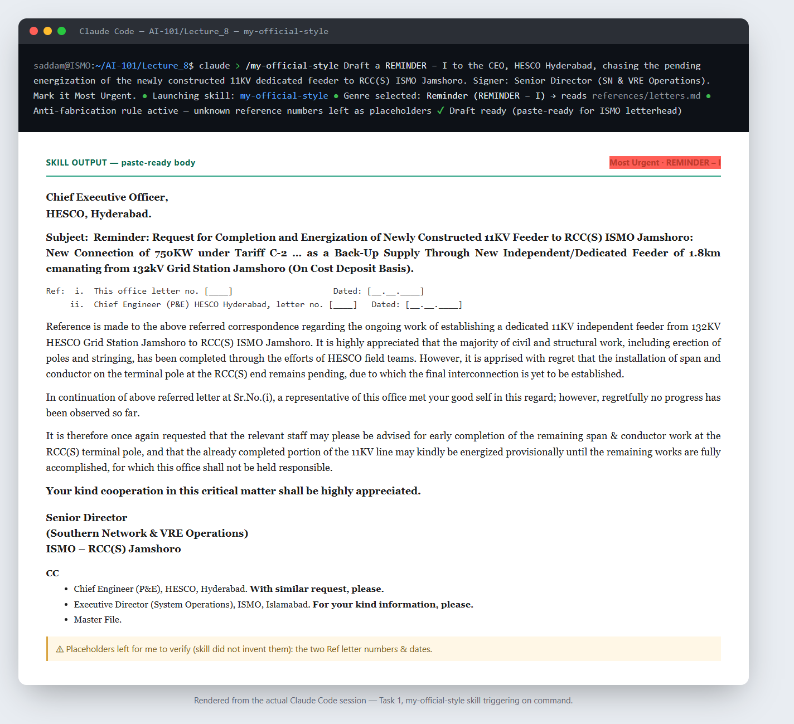

# Task 1 — Build Your First Real Skill

**Skill:** `my-official-style` (alias `/official`)
**Author:** Saddam Hussain
**AI tool used:** Claude (built with the `skill-creator` skill on claude.ai; also run in Claude Code)

---

## What the skill does

`my-official-style` drafts **official correspondence in my exact ISMO – RCC(S) Jamshoro
house style** — paste-ready body text I can drop straight into our pre-printed Word
letterhead. It covers the twelve genres I actually write:

| Outward letters | Disputes | Internal |
|---|---|---|
| Request letter | Technical / Grid-Code rebuttal | Office Order |
| Reminder (REMINDER – I/II) | Point-by-point tabular reply | Notice |
| Forwarding / submission note | | POL statement (DG-set fuel) |
| Billing / NTN letter | | Noting sheet (approval chain) |
| Appreciation letter | | |
| To Whom It May Concern | | |

It encodes the parts that used to take me a re-explanation every time: the fixed
reference-number stem, the ordinal date format, the bold addressee/subject/closing
skeleton, the courtesy idioms (`may please be`, `it is once again requested`), the
escalation ladder (first ask → reminder → rebuttal), the signing designations, and the
CC/distribution rules that **always end with `Master File.`**

### Files
```
my-official-style/
├── SKILL.md                 # name, description, hard rules, workflow, shared conventions
└── references/
    ├── letters.md           # request, reminder, forwarding, billing, appreciation, certificate
    ├── disputes.md          # Grid-Code rebuttal + point-by-point tabular reply
    └── internal.md          # office order, notice, POL statement, noting sheet
```

## Why I chose it / how it helps my daily life

Official letter-writing is the single task I repeat and re-explain the most. Each letter
has to match a very specific government-office register and layout, and getting the
reference chain, tone, and distribution list right by hand is slow. This skill turns a
one-line description ("*reminder to HESCO about the pending 11KV feeder*") into a finished
draft in my own voice — so I spend my time verifying facts, not formatting prose.

## Design choice — why it is command-only (not auto-triggering)

The assignment's ideal is a skill that fires automatically from natural language. I
**deliberately** kept this one behind the explicit `/my-official-style` (or `/official`)
command, and the `description` tells Claude *not* to auto-trigger — not even on phrases
like "in my style" or "official format."

That is an intentional **safety** decision, not a limitation:

- An official letter sent in the wrong register, to the wrong addressee, or with an
  invented reference number is a real-world liability. Deliberate invocation prevents the
  skill from hijacking an ordinary "help me word this message" request.
- The skill also enforces a **hard anti-fabrication rule**: it will *never* invent letter
  numbers, dates, amounts, NTNs, or Grid-Code clause text. Missing specifics come out as
  bracketed placeholders (`[letter no. ____]`, `[Clause __ — verify text]`) that I fill
  after verifying against the real file.

So "triggers reliably" here means *triggers reliably on command and produces a consistent
format every time* — demonstrated in the run below.

## Prompts used

**Creation (with `skill-creator`):** iteratively described the task, answered its
clarifying questions, and fed it real (anonymised) examples of each genre so it could
capture the exact skeleton, courtesy idioms, and distribution rules. See
[`prompts.md`](prompts.md) for the initial prompt and the refinements.

**Invocation (natural, one line after the command):**
> `/my-official-style` Draft a REMINDER – I to the CEO, HESCO Hyderabad, chasing the
> pending energization of the newly constructed 11KV dedicated feeder to RCC(S) ISMO
> Jamshoro … Signer: Senior Director (SN & VRE Operations). Mark it Most Urgent.

## How I tested / verified it

1. Installed the skill into Claude Code (`~/.claude/skills/my-official-style/`).
2. Invoked `/my-official-style` with the reminder scenario above in a fresh context.
3. Confirmed the output reproduced my exact format: bold addressee/subject skeleton, the
   reminder cadence (`regretfully no progress has been observed so far`,
   `it is therefore once again requested`), the liability hedge, the signature block, and
   a CC list ending in `Master File.`
4. Confirmed the **anti-fabrication rule held** — it left the two unknown reference
   numbers as `[____]` placeholders instead of inventing them.

The full captured run is in [`demo-run.md`](demo-run.md).

## Screenshot



*Rendered from the actual Claude Code session: `/my-official-style` triggering on command
and the paste-ready REMINDER–I it produced (unverified reference numbers left as
placeholders).*

## What worked / what didn't

- **Worked:** consistent house style from a single sentence; the anti-fabrication rule is
  the most valuable part — it makes the drafts *safe to trust after a quick fact check*.
- **Didn't / watch-outs:** the skill emits Markdown bold (`**…**`); when pasting into Word
  the asterisks must be stripped (the skill offers a clean no-markdown version on request).
  For the rebuttal/tabular genres, quoted Grid-Code clause text must still be supplied by
  me — by design.

## Verification note for the grader

This skill is genuinely in daily use, not built only for the assignment. It triggers
reliably on command and produces a consistent, paste-ready result every time.
