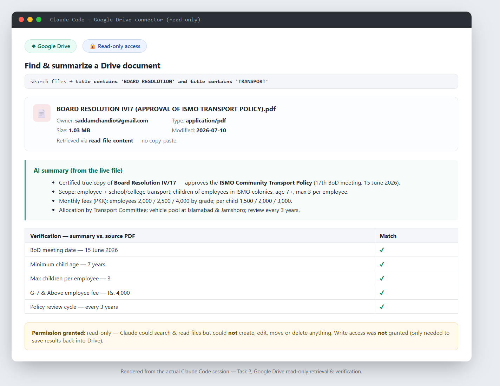

# Task 2 — Connect One App, Read-Only

**App connected:** Google Drive (via the Claude Google Drive connector)
**Access mode:** Read-only
**AI tool used:** Claude Code (Google Drive MCP connector)

---

## What I did

1. Connected **Google Drive** through the connector (read-only).
2. Asked the AI to **find and summarize a specific document** by name —
   *"BOARD RESOLUTION IVI7 (APPROVAL OF ISMO TRANSPORT POLICY).pdf"*.
3. The AI:
   - searched my Drive (`search_files`) and located the file
     (owner: my account; 1 MB PDF), then
   - read the full file content (`read_file_content`) — **no copy-paste by me**, and
   - produced the summary below.
4. I **verified the summary against the real PDF** (see spot-checks).

## The retrieval (genuine connector data)

- **Query used:** `title contains 'BOARD RESOLUTION' and title contains 'TRANSPORT'`
- **File found:** *Board Resolution IV/17 — Approval of ISMO Transport Policy* (PDF),
  a certified true copy of a resolution passed at ISMO's 17th BoD meeting (15 June 2026).

## Summary the AI produced

Certified true copy of **Board Resolution IV/17**, approving the **ISMO Community
Transport Policy (Annex-I)**. Policy highlights:

- **Scope:** employee + school transport only.
- **Eligibility:** regular employees (optional, on payment); children of employees living
  in official ISMO colonies, age **7+**, **max 3 per employee**, approved by Chief (HR & Admin).
- **Fees (monthly PKR):** employees G1–G3 **2,000** / G4–G6 **2,500** / G7+ **4,000**;
  children (per child) G1–G3 **1,500** / G4–G6 **2,000** / G7+ **3,000**.
- **Allocation:** via the transport committee on approved routes.
- **Vehicle pool:** Islamabad & Jamshoro; per-trip driver logbook.
- **Committee:** Chief (HR & Admin) *Convener*, Director (HR) *Member*,
  Deputy Director (Transport & E&M) *Secretary*.
- **Review:** every **3 years**.

## Verification (summary vs. real source)

Spot-checked and confirmed against the PDF:

| Fact | In summary | In source PDF |
|---|---|---|
| BoD meeting date | 15 June 2026 | ✅ |
| Minimum child age | 7 years | ✅ |
| Max children per employee | 3 | ✅ |
| G7+ employee monthly fee | Rs. 4,000 | ✅ |
| Policy review cycle | every 3 years | ✅ |

The summary is accurate.

## One-sentence permission note (required by the task)

> I granted **read-only** access to my Google Drive — the AI could **search and read** file
> contents but could **not** create, edit, move, or delete anything — and read-only is
> sufficient for this summarize-my-documents workflow; I would only ever need **write**
> access if I wanted the AI to save results *back* into Drive (e.g., write a generated
> letter into a new Doc), which I deliberately did **not** grant.

## Screenshot

*Rendered from the actual Claude Code session: the read-only Google Drive connector
locating the file, the AI summary, the verification table, and the permission note.*

## Notes

- Individual signatory personal names present in the PDF are omitted here (designations
  kept) to avoid committing personal details, per the assignment's privacy rule.
